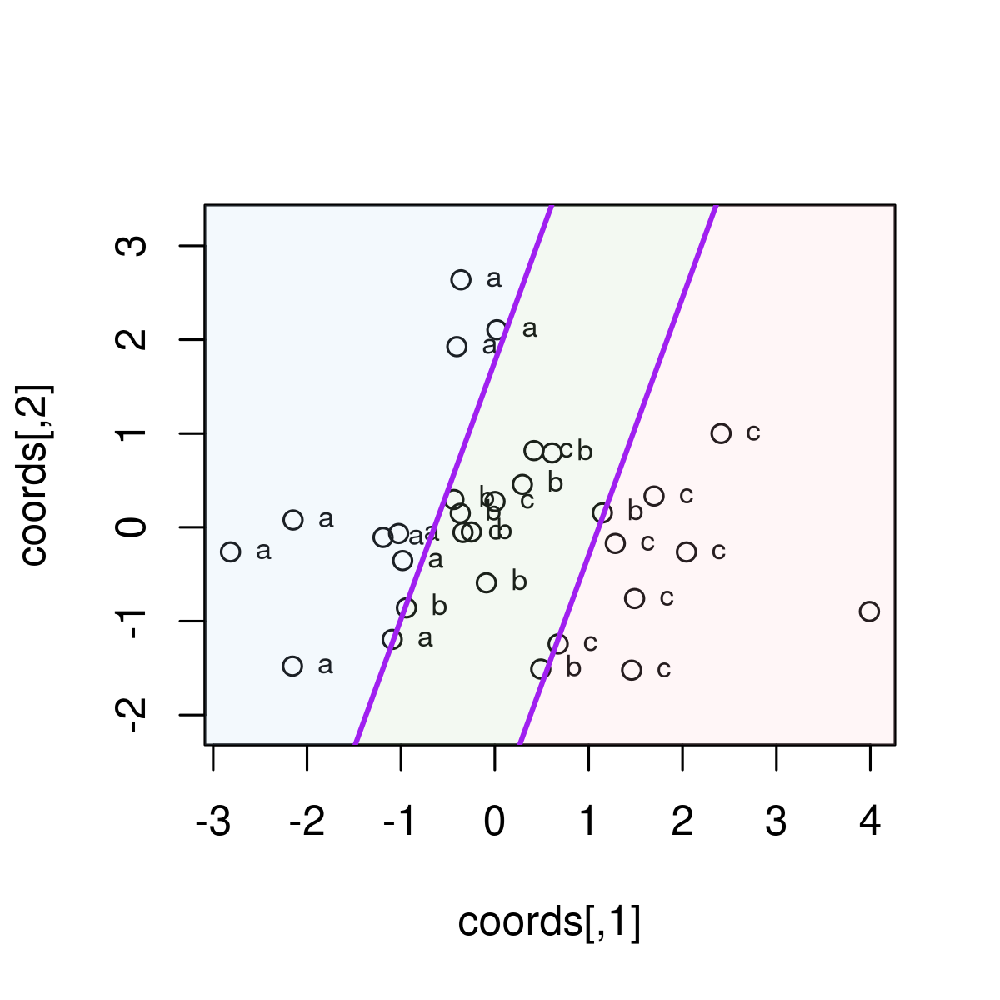
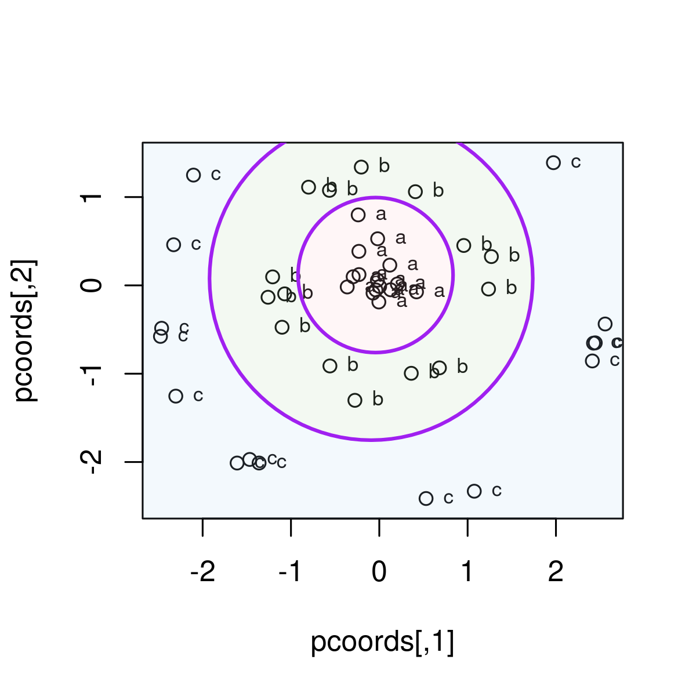
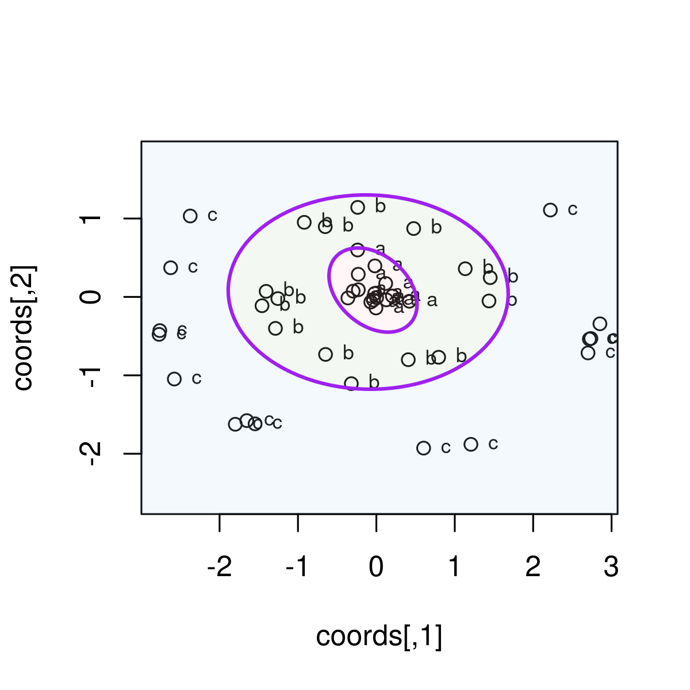
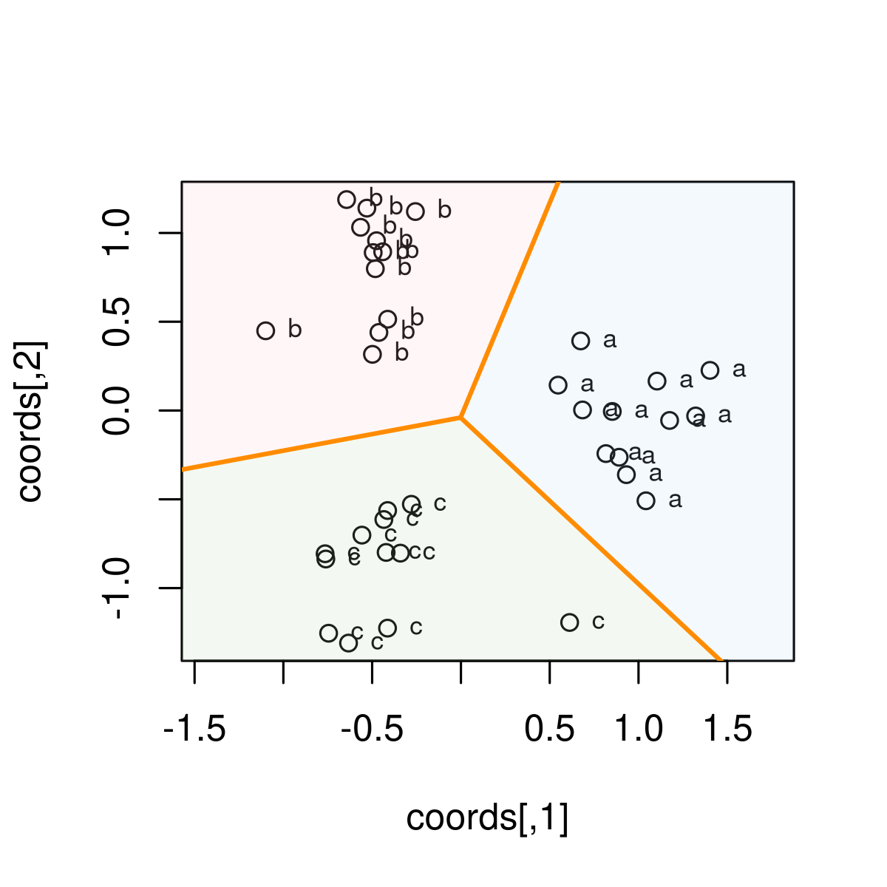
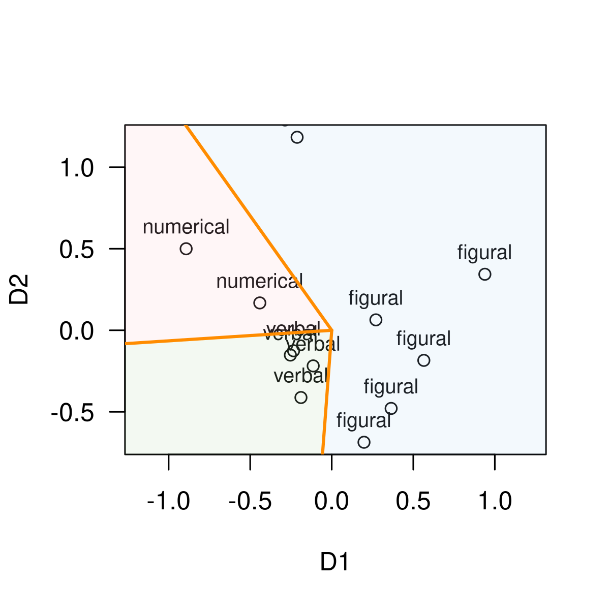
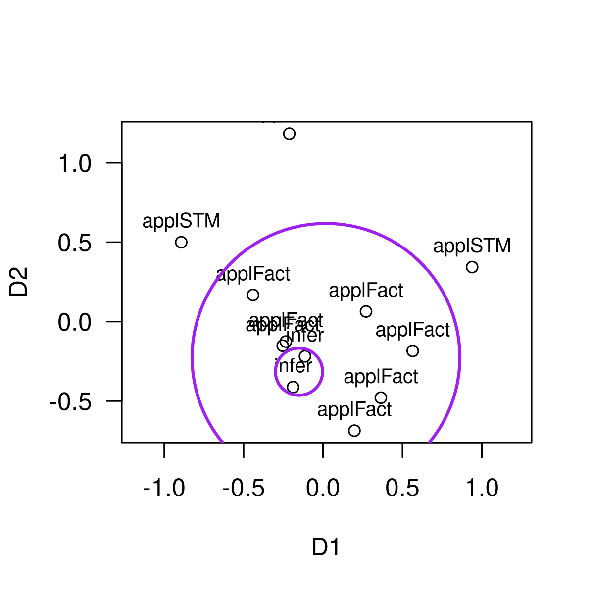
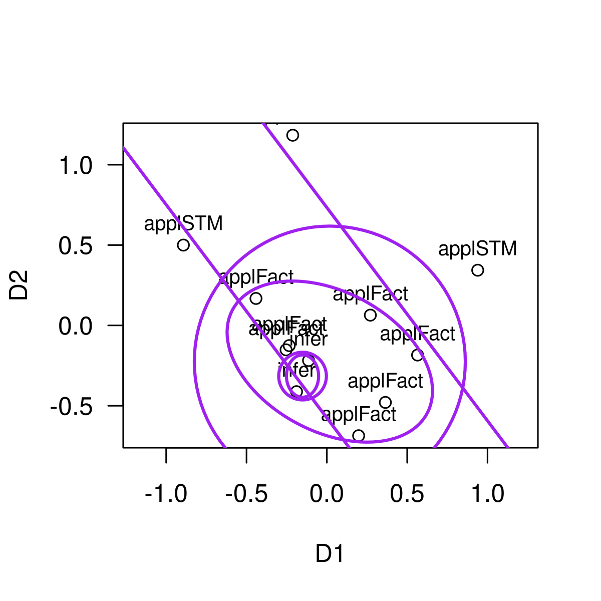
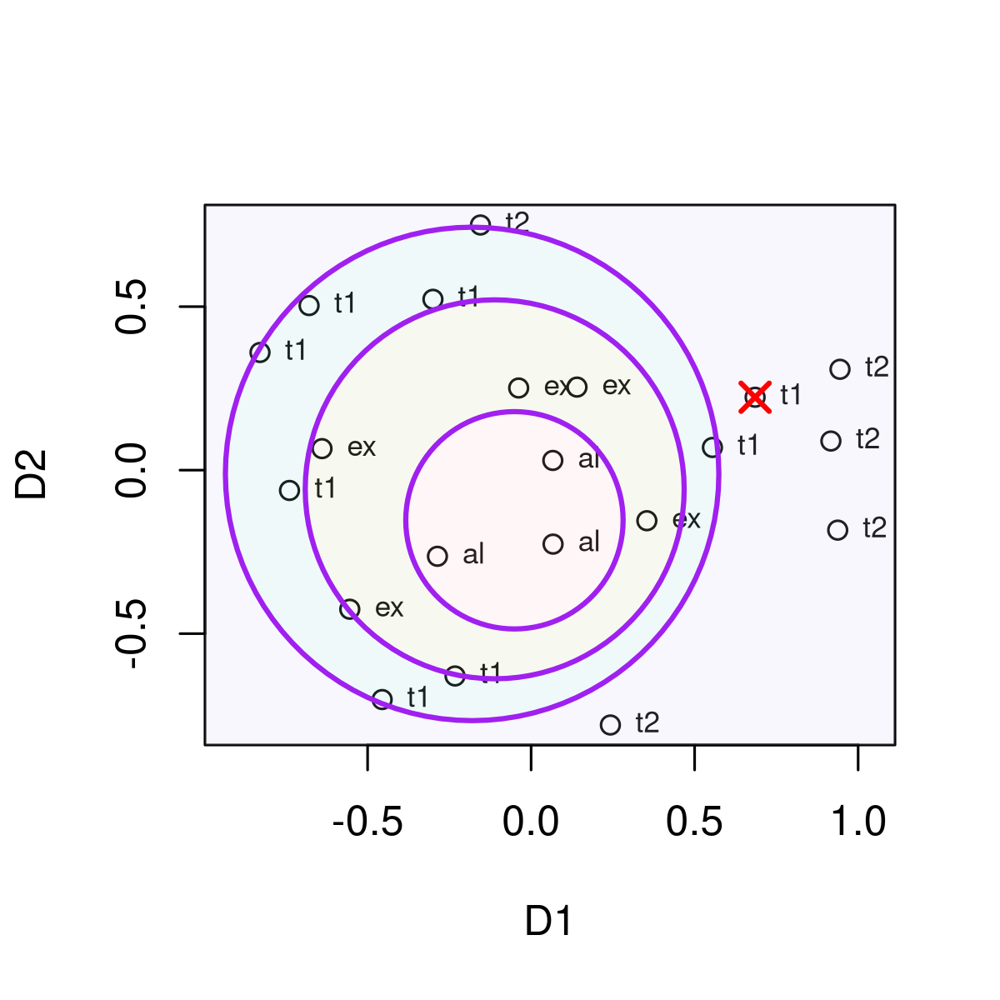

# Facet Theory and Regional Partitions

## Facets, Configurations, and Partitions

Facet Theory (FT) is a meta-approach to empirical research orignally
proposed by Louis Guttman (1957, 1959, 1965) and since then developed by
many others (Borg & Shye, 1995; Canter, 1985; Guttman & Greenbaum, 1998;
Shye, 1998, 1999; Shye, Elizur & Hoffman, 1994). We strongly advise to
acquire a basic understanding of FT before using this package, for
example Shye (1998). An essential step in FT applications is
Multidimensional Scaling (MDS) of similarities/distances; for
introductions see Borg and Groenen (2005), and also refer to the
vignettes of the *smacof* package, which should be installed when using
*facpart*.

The current version of the package can be installed from github. We
recommend to load the packages facpart and smacof in parallel.

``` r

# install.packages("remotes")
# remotes::install_github(repo = "https://github.com/rpfister57/facpart.git")

require(facpart)
#> Loading required package: facpart
#> Loading required package: plotrix
require(smacof)
#> Loading required package: smacof
#> Loading required package: colorspace
#> Loading required package: e1071
#> 
#> Attaching package: 'smacof'
#> The following object is masked from 'package:base':
#> 
#>     transform
```

Assume you are studying some domain (e. g., intelligence), and you
measure a set of items from that domain, say intelligence test items.
Based on your theory, each item can be classified according to the
elements of a *facet*, which is a defining aspect of the domain under
study. With respect to intelligence items, a typical facet is the
*modality* (or symbol system) of the test item, with elements being
*verbal*, *numerical*, and *figural*. Thus, each test item is mapped
onto exactly one of these categories. The theory is assumed to be
confirmed if these facet elements can be identified as geometrical
patterns in an empirical space constructed from measurements of the
items.

The canonical approach is to submit the correlations among the items to
a multidimensional scaling procedure. As a result we obtain
2-dimensional (or higher dimensional) configurations of points (=
items), with highly correlated items being close to each other, and
items with small or negative correlations being farther apart. This
configuration serves as the starting point to search for patterns
according to the theoretical classification from the faceted definition.
A simple pattern might be that all items belonging to a specific
category (e. g., verbal items) are in close vicinity, but apart from
items of a different category. If no such separation can be detected,
the theory must be modified.

Methods such as factor analysis or cluster analysis have traditionally
been used to find patterns in correlations. However, the patterns
emphasized by FT are called *regional partitions*, and are difficult to
detect by traditional methods, if at all.

Three types of partitions are commonly distinguished:

- *Axial* partition: categories are separated by straight parallel lines
  (axes).

- *Radial* partition: categories are separated by circles with different
  radii, emanating from a center.

- *Angular* partition: categories are separated by lines with different
  angles from a common origin.

This will become clear from the examples below. The *facpart* package
provides functions to search for best fitting partitions.

## A Brief Overview

We briefly demonstrate the essential concepts using artificial data from
the functions’ help pages.

### Axial Partitions

Axial partitions represent regions separated by straight lines. The
*axialLines()* function attempts to separate the facet groups using
straight parallel lines. The help page provides a simple demonstration.
Koordinates for 30 points are generated, and three facet elements are
assigned to ten points, respectively.

``` r

set.seed(9876)

crd <- rbind(cbind(rnorm(10, -1), rnorm(10)),
             cbind(rnorm(10,  0), rnorm(10)),
             cbind(rnorm(10,  1), rnorm(10)))
grp <- factor(c(rep("a", 10), rep("b", 10), rep("c", 10)))

axialLines(crd, grp, fill = TRUE, add = FALSE)
```



    #> $slope
    #> [1] 2.747477
    #> 
    #> $intercepts
    #> [1] -3.045128  1.767640
    #> 
    #> $angle
    #> [1] 2.792527
    #> 
    #> $margin
    #> [1] 0.0137848
    #> 
    #> $misclass
    #> [1] 4
    #> 
    #> $misclass_points
    #>              x          y label
    #> 1  3.990025564 -0.8970880     b
    #> 2  0.417433005  0.8182769     c
    #> 3 -0.338888791 -0.0549359     c
    #> 4  0.002191396  0.2750843     c
    #> 
    #> $sector
    #>  [1] 3 3 3 3 3 3 3 3 3 3 2 2 2 2 2 2 2 2 1 2 1 2 1 1 2 1 2 1 1 1
    #> 
    #> $majority
    #> [1] "c" "b" "a"

The resulting plot shows, from left to right, the regions for the
elements ‘a’, ‘b’, and ‘c’, each region separated by a straight line.
The separation is not perfect, but as good as possible, that is, with a
minimum of misclassification per region.

### Radial Partitions

Radial partitions represent circular regions separated by circles or
ellipses. Given a center point, the regions extend from that center,
each additional outer region having a larger radius and including the
previous inner region. The *radialCircles()* and the *radialEllipses()*
functions search for such circular regions separating the facet
elements.

``` r

set.seed(9876)

g1 <- cbind(rnorm(15, 0, 0.2), rnorm(15, 0, 0.2))
th2 <- runif(15, 0, 2 * pi)
g2 <- cbind(1.2 * cos(th2), 1.2 * sin(th2)) + matrix(rnorm(30, 0, 0.1), 15)
th3 <- runif(15, 0, 2 * pi)
g3 <- cbind(2.5 * cos(th3), 2.5 * sin(th3)) + matrix(rnorm(30, 0, 0.1), 15)
crd <- rbind(g1, g2, g3)
grp <- factor(c(rep("a", 15), rep("b", 15), rep("c", 15)))

radialCircles(crd, grp, fill = TRUE, add = FALSE)
```



    #> $cx
    #> [1] -0.04242828 -0.09219946
    #> 
    #> $cy
    #> [1] 0.11678559 0.07745636
    #> 
    #> $radii
    #> [1] 0.8775219 1.8299541
    #> 
    #> $misclass
    #> [1] 0
    #> 
    #> $misclass_points
    #> [1] x     y     label
    #> <0 rows> (or 0-length row.names)
    #> 
    #> $sector
    #>  [1] 1 1 1 1 1 1 1 1 1 1 1 1 1 1 1 2 2 2 2 2 2 2 2 2 2 2 2 2 2 2 3 3 3 3 3 3 3 3
    #> [39] 3 3 3 3 3 3 3
    #> 
    #> $majority
    #> [1] "a" "b" "c"

A three-element facet is generated, with elements ‘a’, ‘b’, and ‘c’. The
plot shows the radial partions, that is, an inner regions containing
points ‘a’, a region with points ‘b’ enclosing the inner ‘a’-region, and
a peripheral region with points ‘c’.

In an analogous way, the *radialElllipses()* functions searches for best
fitting ellipses, generating a nested partitioning of ellipsoid
functions.

``` r

set.seed(9876)

g1 <- cbind(rnorm(15, 0, 0.2), rnorm(15, 0, 0.15))
th2 <- runif(15, 0, 2 * pi)
g2 <- cbind(1.4 * cos(th2), 1.0 * sin(th2)) + matrix(rnorm(30, 0, 0.1), 15)
th3 <- runif(15, 0, 2 * pi)
g3 <- cbind(2.8 * cos(th3), 2.0 * sin(th3)) + matrix(rnorm(30, 0, 0.1), 15)
crd <- rbind(g1, g2, g3)
grp <- factor(c(rep("a", 15), rep("b", 15), rep("c", 15)))

radialEllipses(crd, grp, fill = TRUE, add = FALSE)
```



    #> $cx
    #> [1] -0.04242828 -0.10404963
    #> 
    #> $cy
    #> [1] 0.08758920 0.06189351
    #> 
    #> $a
    #> [1] 0.6364627 1.7861115
    #> 
    #> $b
    #> [1] 0.4456963 1.2389542
    #> 
    #> $angle
    #> [1] 2.423333 3.118879
    #> 
    #> $misclass
    #> $misclass$n
    #> [1] 0
    #> 
    #> $misclass$indices
    #> integer(0)
    #> 
    #> 
    #> $misclass_points
    #> [1] x     y     label
    #> <0 rows> (or 0-length row.names)
    #> 
    #> $sector
    #>  [1] 1 1 1 1 1 1 1 1 1 1 1 1 1 1 1 2 2 2 2 2 2 2 2 2 2 2 2 2 2 2 3 3 3 3 3 3 3 3
    #> [39] 3 3 3 3 3 3 3
    #> 
    #> $majority
    #> [1] "a" "b" "c"

Generally, for radial partition functions, the separating circles or
ellipses need not have a common center, but are constrained to be
nested, that is, each outer region will include the interior regions.

## Angular Partitions

Angular partitions represent wedge-like regions, originating from a
common center; the regions will look similar to triangular pieces from a
round piece of cake or pizza. The *angularPartition()* function searches
for such regions, generating lines with different angles emanating from
a common origin.

``` r

set.seed(9876)

theta <- rep(c(0, 2 * pi / 3, 4 * pi / 3), each = 12) + rnorm(36, 0, 0.25)
r     <- runif(36, 0.5, 1.5)
crd   <- cbind(r * cos(theta), r * sin(theta))
grp   <- factor(rep(c("a", "b", "c"), each = 12))

angularPartition(crd, grp, add = FALSE, fill = TRUE)
```



    #> $cuts
    #> [1] -0.7517708  1.1775085 -2.9571945
    #> 
    #> $margin
    #> [1] 0.3707055
    #> 
    #> $misclass
    #> [1] 0
    #> 
    #> $misclass_points
    #> [1] x     y     label
    #> <0 rows> (or 0-length row.names)
    #> 
    #> $sector
    #>  [1] 3 3 3 3 3 3 3 3 3 3 3 3 1 1 1 1 1 1 1 1 1 1 1 1 2 2 2 2 2 2 2 2 2 2 2 2
    #> 
    #> $majority
    #> [1] "b" "c" "a"
    #> 
    #> $center
    #> [1] -0.001846992 -0.039872202
    #> 
    #> $pt_angles
    #>  [1]  0.32149865 -0.24286594 -0.01371260  0.00695637  0.06268145 -0.24513717
    #>  [7]  0.18369496 -0.42183313  0.18711272  0.04052829  0.56823932 -0.33152769
    #> [13]  2.05257795  1.78677774  1.99153876  2.09094730  2.51915703  2.01009170
    #> [19]  2.72260523  2.05795544  2.20873940  2.33541115  2.05475273  2.01442570
    #> [25] -2.35380896 -2.21628526 -1.98863070 -2.03203318 -1.08170854 -2.23652965
    #> [31] -1.90492012 -2.07545851 -2.26925484 -2.12004313 -2.33215861 -2.08743358

The plot shows how the three facet elements ‘a’, ‘b’, and ‘c’ are
separated by straight lines with a common origin in a wedge-like
pattern.

## The Basic Workflow

As an example we take the intelligence study by Guttman and Levy (1991).
The correlation matrix of 12 intelligence test items and the assignment
to three facets (Material, Modality, Rule) is provided in the *gutt91*
data object (modified and extended Guttman1991 data from the smacof
package). The 12 test items are actually 12 subtests from the WISC-R,
and the sample are 2200 U.S. children aged 6.5 to 16.5 years (see
Guttman & Levy, 1991).

The gutt91 data contain a lot of further information, but for the moment
we just extract the correlation matrix and the dataframe with facet
definitions.

``` r

data(gutt91)

Kor <- gutt91$gutt91_cor
Facets <- gutt91$gutt91_df

Facets
#>                                 items Material  Modality     Rule         X1
#> Information               Information     Oral    verbal applFact -0.2536557
#> Similarities             Similarities     Oral    verbal    infer -0.1137925
#> Arithmetic                 Arithmetic     Oral numerical applFact -0.4410249
#> Vocabulary                 Vocabulary     Oral    verbal applFact -0.2341282
#> Comprehension           Comprehension     Oral    verbal    infer -0.1887449
#> DigitSpan                   DigitSpan     Oral numerical  applSTM -0.8928474
#> PictureCompletion   PictureCompletion     Oral   figural applFact  0.1978224
#> PictureArrangement PictureArrangement   Manual   figural applFact  0.3642192
#> BlockDesign               BlockDesign   Manual   figural applFact  0.2707838
#> ObjectAssembly         ObjectAssembly   Manual   figural applFact  0.5647150
#> Coding                         Coding    Paper   figural  applSTM -0.2123476
#> Mazes                           Mazes    Paper   figural  applSTM  0.9390008
#>                             X2         D1          D2           D3
#> Information        -0.15190509 -0.2607345 -0.14330818  0.022241000
#> Similarities       -0.21840762 -0.1254660 -0.27272665  0.035737532
#> Arithmetic          0.16780236 -0.4232661  0.10074101  0.310579184
#> Vocabulary         -0.12571647 -0.2623318 -0.13834063 -0.012430979
#> Comprehension      -0.41232278 -0.2455010 -0.32650735 -0.184040673
#> DigitSpan           0.49987343 -0.7355785  0.63826052  0.363434120
#> PictureCompletion  -0.68657756  0.3135845 -0.53410786  0.248713125
#> PictureArrangement -0.47923328  0.2842056 -0.23684569 -0.567151304
#> BlockDesign         0.06385235  0.2830315 -0.04178309  0.083479149
#> ObjectAssembly     -0.18450416  0.6240344 -0.29125210  0.009257765
#> Coding              1.18363379 -0.2406658  0.82913448 -0.701789299
#> Mazes               0.34350503  0.7886878  0.41673555  0.391970379
Kor
#>                    Information Similarities Arithmetic Vocabulary Comprehension
#> Information               1.00         0.62       0.54       0.55          0.42
#> Similarities              0.62         1.00       0.69       0.36          0.48
#> Arithmetic                0.54         0.47       1.00       0.40          0.40
#> Vocabulary                0.69         0.67       0.52       1.00          0.28
#> Comprehension             0.55         0.59       0.44       0.66          1.00
#> DigitSpan                 0.36         0.34       0.45       0.38          0.26
#> PictureCompletion         0.40         0.46       0.34       0.43          0.41
#> PictureArrangement        0.42         0.41       0.30       0.44          0.40
#> BlockDesign               0.48         0.50       0.46       0.48          0.44
#> ObjectAssembly            0.40         0.41       0.29       0.39          0.37
#> Coding                    0.28         0.28       0.32       0.32          0.26
#> Mazes                     0.27         0.28       0.27       0.27          0.29
#>                    DigitSpan PictureCompletion PictureArrangement BlockDesign
#> Information             0.27              0.46               0.52        0.32
#> Similarities            0.47              0.41               0.44        0.27
#> Arithmetic              0.67              0.50               0.45        0.66
#> Vocabulary              0.59              0.41               0.34        0.38
#> Comprehension           0.34              0.28               0.30        0.43
#> DigitSpan               1.00              0.28               0.46        0.44
#> PictureCompletion       0.21              1.00               0.29        0.48
#> PictureArrangement      0.22              0.40               1.00        0.39
#> BlockDesign             0.31              0.52               0.46        1.00
#> ObjectAssembly          0.21              0.48               0.42        0.60
#> Coding                  0.29              0.19               0.25        0.33
#> Mazes                   0.22              0.34               0.32        0.44
#>                    ObjectAssembly Coding Mazes
#> Information                  0.32   0.21  0.34
#> Similarities                 0.27   0.22  0.46
#> Arithmetic                   0.26   0.31  0.42
#> Vocabulary                   0.41   0.21  0.25
#> Comprehension                0.40   0.29  0.32
#> DigitSpan                    0.44   0.22  0.60
#> PictureCompletion            0.37   0.40  0.33
#> PictureArrangement           0.26   0.52  0.44
#> BlockDesign                  0.29   0.48  0.24
#> ObjectAssembly               1.00   0.19  0.37
#> Coding                       0.24   1.00  0.21
#> Mazes                        0.37   0.21  1.00
```

The items in the Facets dataframe are named according to the labels in
Guttman and Levy (1991). We see that the first facet *Material* assigns
to each item the materiality of the task the item represents (Guttman
and Levy, 1991, call this *Mode of Expression*): It can be ‘oral’ if it
is just based on oral communication, or ‘manual’ if the participant has
to actually manipulate something with his or her hands, or ‘paper’ if
the item requires to use paper and pencil to write something. The second
facet *Modality* defines the symbol system involved (Guttman and Levy,
1991, call this *Format of Communication*): ‘verbal’ refers to text in
natural language, ‘numerical’ refers to numbers and mathematical
notation, and ‘figural’ refers to drawings, geometric shapes, or
pictorial representations. The third facet *Rule* (called *Rule Task* by
Guttman and Levy) defines the core of what an intelligence item is: it
asks about an objective rule, and the answer can be correct or false.
Either the required rule has to be inferred by the testee (‘infer’), or
a factual rule hast to be applied (‘applFact’), or what just has been
learned and is stored in short term memory (‘applSTM’). For details
about the theoretical rationale refer to Guttman and Levy (1991).

Theoretically, we expect that these distinctions show up in specific
patterns or *regional partitions* of a geometrical representation of the
items. Thus, we perform a multidimensional scaling analysis of the
correlation matrix. Since MDS takes distances as input data, we have to
convert the correlation matrix (which are similarities) to distances.
The conversion of correlations to distances follows the equation
``` math
d = \sqrt {1 - r}
```

The distances are then submitted to MDS. For converting and for MDS we
use functions from the *smacof* package.

``` r

Kor_D <- smacof::sim2diss(Kor, method = "corr", to.dist = TRUE)

gutt91_mds <- smacof::mds(Kor_D, type = "ordinal")
gutt91_mds
#> 
#> Call:
#> smacof::mds(delta = Kor_D, type = "ordinal")
#> 
#> Model: Symmetric SMACOF 
#> Number of objects: 12 
#> Stress-1 value: 0.102 
#> Number of iterations: 67
```

The Stress-1 value of the resulting 2-dimensional configuration is
*0.102* which is usually considered a good fit (note that currently
*facpart* only works with 2-dimensional configurations). To plot the fit
we can simply take the output object *gutt91_mds* as argument for the
plot function. However, usually another approach is preferable which
gives more control; in particular, we want the facet elements as labels,
not the item names. Thus, we first plot only the coordinates of the 12
items, which are in *gutt91_mds\$conf*. Then we add the facet labels for
*Modality* with the [`text()`](https://rdrr.io/r/graphics/text.html)
function; the labels are in the Facets data frame. The resulting plot
now nicely shows the configuration of the three categories for modality,
and we can check if a regular pattern can be identified.

``` r

plot(gutt91_mds)
```


``` r


plot(gutt91_mds$conf, 
     asp = 1, las = 1)
text(gutt91_mds$conf, labels = Facets$Modality, 
     cex = 0.8, pos = 2)
abline(v=0, lty = 2); abline(h=0, lty = 2)
```


Let’s assume that our theory predicts that the Modality facet can be
partitioned according to an *angular partition*, that is, from a common
origin lines or rays of different angles divide the space into
wedge-like regions. The
[`angularPartition()`](https://rpfister57.github.io/facpart/reference/angularPartition.md)
function does exactly this: It searches for a best fitting angular
partition, so that each region contains only items of one specific facet
element. If that is not perfectly possible, it minimizes the number of
misclassified items and yields the best possible partitioning. The
necessary arguments are the point coordinates (crd =), and the facet
assignments for each point (group =). The coordinates must be a numeric
matrix or data frame with two numeric columns, and the facet labels
should be a factor with levels corresponding to the facet labels.

``` r

plot(gutt91_mds$conf, 
     asp = 1, las = 1)
text(gutt91_mds$conf, labels = Facets$Modality, 
     cex = 0.8, pos = 3)

gutt91_mod_ang <- angularPartition(crd = gutt91_mds$conf,
                                   group = Facets$Modality, 
                                   add = TRUE, fill = TRUE)
```



The partition lines are drawn into the existing plot, emerging from a
center at (0,0), and separating the configuration into three regions: an
upper wedge containing the two Paper items, a lower right wedge
containing the three Manual items, and a left wedge containing the Oral
items. No misclassified items are observed.

``` r

plot(gutt91_mds$conf, 
     asp = 1, las = 1)
text(gutt91_mds$conf, labels = Facets$Rule, 
     cex = 0.8, pos = 3)

gutt91Rule <- radialCircles(crd = gutt91_mds$conf,
                 group = Facets$Rule, add = TRUE)
```



``` r


highlightMisclass(gutt91Rule)
```

Just for demonstration purposes, we add the partions obtained by the
other major functions (axial, circles, ellipses):

``` r

plot(gutt91_mds$conf, 
     asp = 1, las = 1)
text(gutt91_mds$conf, labels = Facets$Rule, 
     cex = 0.8, pos = 3)

axialLines(crd = gutt91_mds$conf,
           group = Facets$Rule)
#> $slope
#> [1] -1.327045
#> 
#> $intercepts
#> [1] -0.5756567  0.7333685
#> 
#> $angle
#> [1] 0.6457718
#> 
#> $margin
#> [1] 0.05244161
#> 
#> $misclass
#> [1] 2
#> 
#> $misclass_points
#>                       x          y   label
#> Similarities -0.1137925 -0.2184076   infer
#> DigitSpan    -0.8928474  0.4998734 applSTM
#> 
#> $sector
#>  [1] 2 2 2 2 1 1 2 2 2 2 3 3
#> 
#> $majority
#> [1] "infer"    "applFact" "applSTM"

radialCircles(crd = gutt91_mds$conf,
                 group = Facets$Rule)
#> $cx
#> [1] -0.15126870  0.01846602
#> 
#> $cy
#> [1] -0.3153652 -0.2252236
#> 
#> $radii
#> [1] 0.1484136 0.8433509
#> 
#> $misclass
#> [1] 0
#> 
#> $misclass_points
#> [1] x     y     label
#> <0 rows> (or 0-length row.names)
#> 
#> $sector
#>  [1] 2 1 2 2 1 3 2 2 2 2 3 3
#> 
#> $majority
#> [1] "infer"    "applFact" "applSTM"

radialEllipses(crd = gutt91_mds$conf,
                 group = Facets$Rule)
```



    #> $cx
    #> [1] -0.15126870  0.01846602
    #> 
    #> $cy
    #> [1] -0.3153652 -0.2252236
    #> 
    #> $a
    #> [1] 0.10000 0.68604
    #> 
    #> $b
    #> [1] 0.1315365 0.4351220
    #> 
    #> $angle
    #> [1] 0.000000 2.653376
    #> 
    #> $misclass
    #> $misclass$n
    #> [1] 0
    #> 
    #> $misclass$indices
    #> integer(0)
    #> 
    #> 
    #> $misclass_points
    #> [1] x     y     label
    #> <0 rows> (or 0-length row.names)
    #> 
    #> $sector
    #>  [1] 2 1 2 2 1 3 2 2 2 2 3 3
    #> 
    #> $majority
    #> [1] "infer"    "applFact" "applSTM"

To summarize, the *basic workflow* is:

- Construct a *distance matrix D* of a set of n items, typically from a
  *correlation matrix K*. If necessary, convert K to D with
  [`smacof::sim2diss()`](https://rdrr.io/pkg/smacof/man/sim2diss.html).

- Assign *facet labels*: Assign to each of n items exactly one of k (k
  \< n) labels corresponding to their facet elements. Store the
  assignment as a factor F with length = n (same item order as in D).

- Apply non-metric multidimensional scaling to D, such as
  `smacof::mds(D, ndim = 2, type = "ordinal")`. Check for fit and store
  the result object, for example as *out_mds*.

- *Plot* the point configuration, for example `plot(out_mds)`.

- Apply one of the `partition functions`; necessary arguments are `crd`
  (the point coordinates) and `group` (the facet assignments).

- Check the resulting plot. Check for regional fit and
  misclassifications.

More details will be provided in the following discussions of the major
partition functions.

## Axial Partitions

An axial partition partitions the configuration into stripes separated
by parallel lines. For example, two parallel lines divide the
configuration into three stripes or bands, inducing an order along a
dimension (a *simplex*). If each stripe contains exactly one type of
facet element, we will have a perfect separation of facet elements. If
we have two facets, and each facet yields an axial partition (with
approximately orthogonal dimensions), the resulting pattern is called a
*duplex*.

In the simple case of only two facet elements, a single line suffices to
separate the two elements. This is basically equivalent to linear
discriminant analysis, with the point coordinates serving as the
independent and the facet elements as the dependent grouping variable.
The partitioning line will then be orthogonal to the discriminant
function.

As an example, we use a study about student emotions in learning
contexts.

## Radial Partitions

A radial partition creates quasi-circular regions, emanating from a
central region of the configuration. Thus, the partitioning regions are
a function of the radius from the center. In the simple case of two
facet elements a1 and a2, items of element a1 might be located around
the center of the configuration, and elements a2 located in the
periphery, separable by a circular line. With more than two elements,
the regions will form circular-like strips with increasing distance from
the center.

I the most general case, the circular-like regions can be separated by
any kind of closed line, such as an ellipse, an oval, or some irregular
closed curve. The facpart package provides two approaches: (i) find best
fitting circles, (ii) find best fitting ellipses. Neither circles nor
ellipses are expected to be strictly concentric (identical origin), but
we impose the restriction that they be nested.

### Circular Partitions

To demonstrate, we use data from the *smacof* package representing
intelligence tests (Guttman, 1965) classified with respect to the type
of cognitive operation required: analytical, complex, achievement (1 and
2), are the four facet elements. The data provided in the *facpart*
package are *guttman65mds*, containing a data frame with 21 rows (test
items), the coordinates D1 and D2 from a 2-dimensional MDS, and the
facet labels (gfacets). For plotting we extract a two-character vector
*gf* representing the facet elements.

``` r

data(guttman65mds)
str(guttman65mds)
#> 'data.frame':    21 obs. of  3 variables:
#>  $ gfacets: Factor w/ 4 levels "analytical","complex",..: 1 1 1 2 2 2 2 2 3 3 ...
#>  $ D1     : num  0.0671 0.0664 -0.2864 0.3539 0.1403 ...
#>  $ D2     : num  -0.2262 0.0296 -0.2634 -0.1546 0.254 ...

gf_nc <- nchar(as.character(guttman65mds$gfacets))
gf <- substr(guttman65mds$gfacets, gf_nc - 1, gf_nc)


plot(guttman65mds[ , 2:3], 
     pch = 19, 
     xlim = c(-1.5, 1.5), ylim = c(-1, 1),
     asp = 1)
text(guttman65mds[ , 2:3], labels = gf,
     cex = 0.8, pos = 3)
abline(h = 0)
abline(v = 0)
```


According to theory, the analytical tests are expected to locate the
center of the configuration, the complex test a region around the
center, and the achievement test should be located at the periphery;
thus, a gradient of cognitive ability would emerge going outwards from
the center. In facet theoretical terms, the facet is assumed to play a
radial role. We apply the
function[`radialCircles()`](https://rpfister57.github.io/facpart/reference/radialCircles.md)
to find the best partitions in terms of circles enclosig the central
region.

``` r

circlesGutt65_out <- radialCircles(
    crd = guttman65mds[ , 2:3],
    group = gf,
    fill = TRUE, add = FALSE)

highlightMisclass(circlesGutt65_out)
```



Exactly one point is misclassified, and we can highlight misclassified
points with the highlightMisclass() function.

## References

Borg, I., & Shye, S. (1995). Facet theory: Form and content. Sage.

Canter, D. (Ed.). (1985). Facet theory: Approaches to social research.
Springer.

Guttman, L. (1957). Empirical Verification of the Radex Structure of
Mental Abilities and Personality Traits. Educational and Psychological
Measurement, 17, 391–407.

Guttman, L. (1959). Introduction to Facet Design and Analysis. In
Proceedings of the Fifteenth International Congress of Psychology,
130–132.

Guttman, L. (1965). A Faceted Definition of Intelligence. In R.
Eifermann (Ed.), Studies in Psychology.

Guttman, L., & Levy, S. (1991). Two structural laws for intelligence
tests. Intelligence, 15(1), 79–103.
<https://doi.org/10.1016/0160-2896(91)90023-7>

Guttman, R., & Greenbaum, C. W. (1998). Facet theory: Its development
and current status. European Psychologist, 3(1), 13–36.
<https://doi.org/10.1027/1016-9040.3.1.13>

Shye, S. (1998). Modern facet theory: Content design and measurement in
behavioral research. European Journal of Psychological Assessment,
14(2), 160–171.

Shye, S. (1999). Facet theory. In A. E. Kazdin (Ed.), Encyclopedia of
statistical sciences: Update (Vol. 3, pp. 231–239). Wiley

Shye, S., Elizur, D., & Hoffman, M. (1994). Introduction to facet
theory: Content, theory, and application. Sage.
