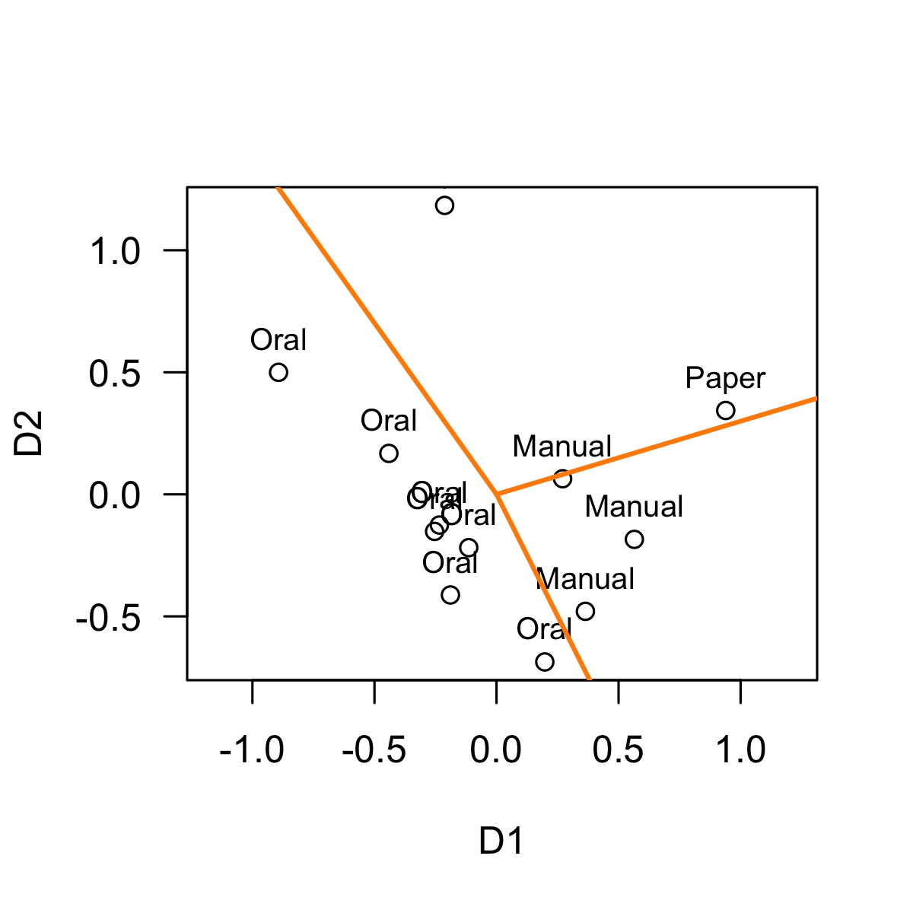
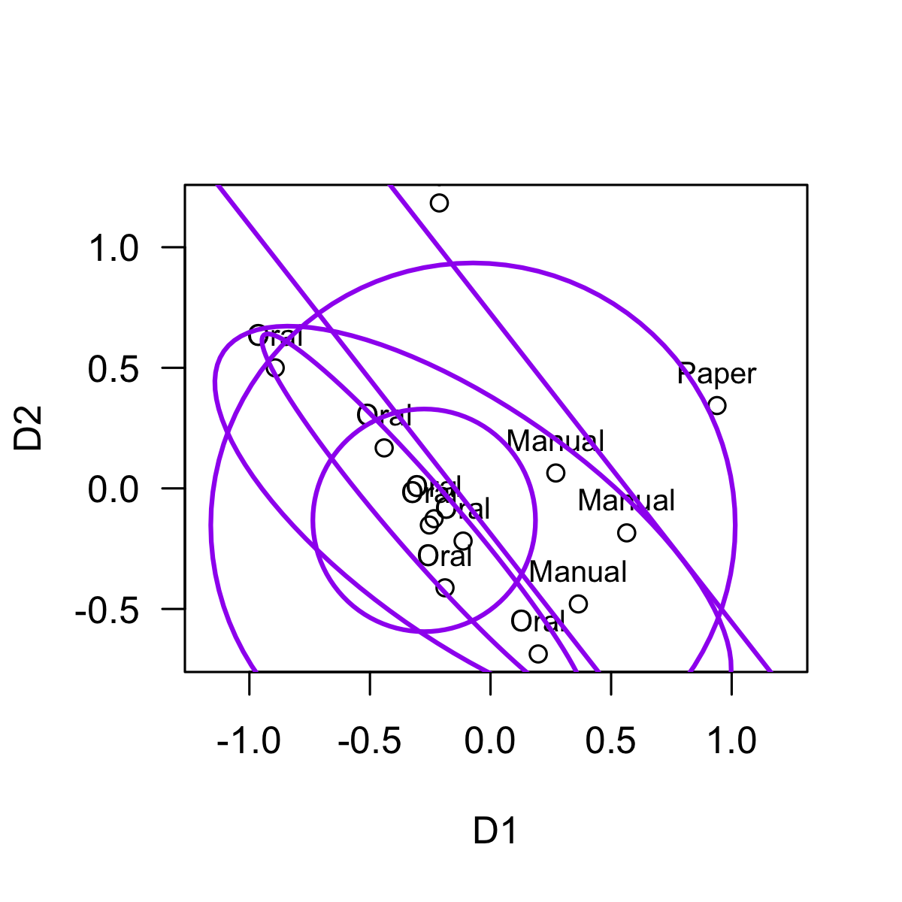
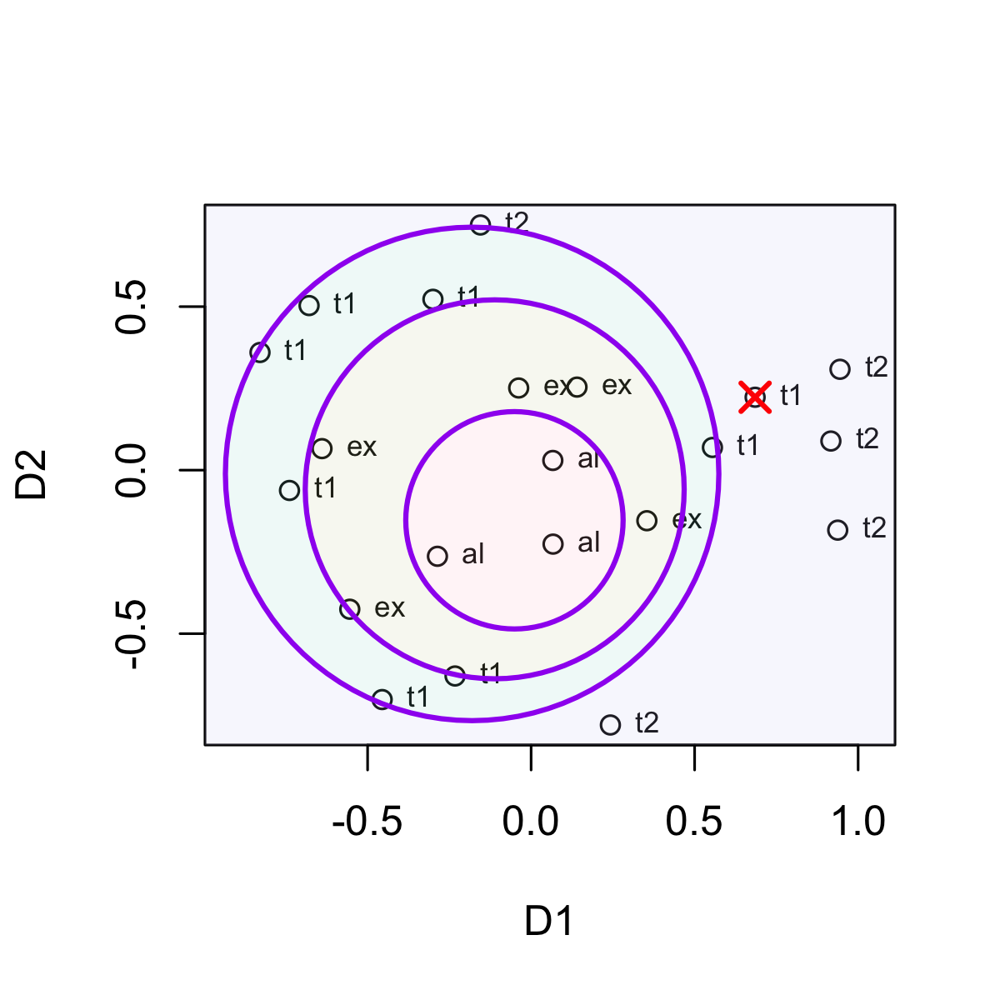

# Facet Theory and Partitions

## Facets, Configurations, and Partitions

Facet Theory (FT) is a meta-approach to empirical research proposed by
Louis Guttman ( ) and since then developed by many others ( ). We
strongly advise to acquire a basic understanding of FT before using this
package, for example Shye (1998). An essential step in FT applications
is Multidimensional Scaling (MDS) of similarities/distances; for
introductions see Borg and Groenen (2005), and also refer to the
vignettes of the *smacof* package, to which this package is closely
related and which should be installed when using *facpart*.

``` r

require(facpart)
#> Loading required package: facpart
#> Loading required package: plotrix
require(smacof)
#> Loading required package: smacof
#> Loading required package: colorspace
#> Loading required package: e1071
#> 
#> Attaching package: 'smacof'
#> The following object is masked from 'package:base':
#> 
#>     transform
```

Assume you are studying some domain (e. g., intelligence), and you
measure a set of items from that domain, say intelligence test items.
Theoretically, each item is classified according to the elements of a
*facet*: With respect to intelligence items, a typical facet is the
*modality* of the test item, with elements being *verbal*, *numerical*,
and *figural*. Thus, each test item is mapped onto exactly one of these
categories. The theory is assumed to be confirmed if these elements can
be identified as geometrical patterns in an empirical space of the test
items.

The canonical approach is to submit the correlations among the items to
a multidimensional scaling procedure. As a result we obtain
2-dimensional (or higher dimensional) configurations of points (=
items), with highly correlated items being close to each other, and
items with small or negative correlations being farther apart. This
configuration serves as the starting point to search for patterns
according to the theoretical classification from the faceted definition.
A simple pattern might be that all items belonging to a specific
category (e. g., verbal items) are in close vicinity, but apart from
items of a different category. If no such separation can be detected,
the theory must be modified.

The patterns emphasized by FT are called *regional partitions*. Three
types of partitions are commonly identified:

- *Axial* partition: categories are separated by straight parallel
  lines.

- *Radial* partition: categories are separated by nested circles.

- *Angular* partition: categories are separated by lines with different
  angles from a common origin.

This will become clear from the examples below. The *facpart* package
provides functions to search for best fitting partitions.

## The Basic Workflow

As an example we take the Intelligence study (Guttman & Levy, 1991). The
correlation matrix of 12 intelligence test items and the assignment to
two facets (Material, Modality) is provided in the *gutt91* data file
(slightly modified from Guttman1991 from the smacof package). We extract
the correlation matrix and the facet variables.

``` r

data(gutt91)
Kor <- gutt91$gutt91_cor
Facets <- gutt91$gutt91_var
round(Kor, 2)
#>                    Information Similarities Arithmetic Vocabulary Comprehension
#> Information               1.00         0.62       0.54       0.55          0.42
#> Similarities              0.62         1.00       0.69       0.36          0.48
#> Arithmetic                0.54         0.47       1.00       0.40          0.40
#> Vocabulary                0.69         0.67       0.52       1.00          0.28
#> Comprehension             0.55         0.59       0.44       0.66          1.00
#> DigitSpan                 0.36         0.34       0.45       0.38          0.26
#> PictureCompletion         0.40         0.46       0.34       0.43          0.41
#> PictureArrangement        0.42         0.41       0.30       0.44          0.40
#> BlockDesign               0.48         0.50       0.46       0.48          0.44
#> ObjectAssembly            0.40         0.41       0.29       0.39          0.37
#> Coding                    0.28         0.28       0.32       0.32          0.26
#> Mazes                     0.27         0.28       0.27       0.27          0.29
#>                    DigitSpan PictureCompletion PictureArrangement BlockDesign
#> Information             0.27              0.46               0.52        0.32
#> Similarities            0.47              0.41               0.44        0.27
#> Arithmetic              0.67              0.50               0.45        0.66
#> Vocabulary              0.59              0.41               0.34        0.38
#> Comprehension           0.34              0.28               0.30        0.43
#> DigitSpan               1.00              0.28               0.46        0.44
#> PictureCompletion       0.21              1.00               0.29        0.48
#> PictureArrangement      0.22              0.40               1.00        0.39
#> BlockDesign             0.31              0.52               0.46        1.00
#> ObjectAssembly          0.21              0.48               0.42        0.60
#> Coding                  0.29              0.19               0.25        0.33
#> Mazes                   0.22              0.34               0.32        0.44
#>                    ObjectAssembly Coding Mazes
#> Information                  0.32   0.21  0.34
#> Similarities                 0.27   0.22  0.46
#> Arithmetic                   0.26   0.31  0.42
#> Vocabulary                   0.41   0.21  0.25
#> Comprehension                0.40   0.29  0.32
#> DigitSpan                    0.44   0.22  0.60
#> PictureCompletion            0.37   0.40  0.33
#> PictureArrangement           0.26   0.52  0.44
#> BlockDesign                  0.29   0.48  0.24
#> ObjectAssembly               1.00   0.19  0.37
#> Coding                       0.24   1.00  0.21
#> Mazes                        0.37   0.21  1.00
Facets
#>                 items Material  Modality
#> 1         Information     Oral    verbal
#> 2        Similarities     Oral    verbal
#> 3          Arithmetic     Oral numerical
#> 4          Vocabulary     Oral    verbal
#> 5       Comprehension     Oral    verbal
#> 6           DigitSpan     Oral numerical
#> 7   PictureCompletion     Oral   figural
#> 8  PictureArrangement   Manual   figural
#> 9         BlockDesign   Manual   figural
#> 10     ObjectAssembly   Manual   figural
#> 11             Coding    Paper numerical
#> 12              Mazes    Paper   figural
```

In the Facets dataframe we can see that the first facet *Material*
assigns to each item the materiality of the task the item represents: It
can be ‘oral’ if it is just based on oral communication, or ‘manual’ if
the participant has to actually do something with his or her hands, or
‘paper’ if the item requires to read/write from a sheet of paper. The
second facet *Modality* defines the symbol system involved: ‘verbal’
refers to text in natural language, ‘numerical’ refers to numbers and
mathematical notation, and ‘figural’ refers to drawings, geometric
shapes, etc.

Theoretically, we expect that these distinctions show up in specific
patterns or *partitions* of a geometrical representation of the items.
Thus, we perform a multidimensional scaling analysis of the correlation
matrix. Since MDS takes distances as input data, we have to convert the
correlation matrix (which are similarities) to distances. The conversion
of correlations to distances follows the equation
``` math
d = \sqrt {1 - r}
```

The distances are then submitted to MDS. For converting and for MDS we
use functions from the *smacof* package.

``` r

Kor_D <- smacof::sim2diss(Kor, method = "corr", to.dist = TRUE)

gutt91_mds <- smacof::mds(Kor_D, type = "ordinal")
gutt91_mds
#> 
#> Call:
#> smacof::mds(delta = Kor_D, type = "ordinal")
#> 
#> Model: Symmetric SMACOF 
#> Number of objects: 12 
#> Stress-1 value: 0.102 
#> Number of iterations: 67
```

The Stress-1 value of the resulting 2-dimensional configuration is
*0.102* which is usually considered a good fit (note that currently
*facpart* only applies to 2-dimensional configurations). To plot the fit
we can simply take the output object *gutt91_mds* as argument for the
plot function. However, usually another approach is preferable which
gives more control; in particular, we want the facet elements as labels,
not the item names. Thus, we first plot only the coordinates of the 12
items, which are in *gutt91_mds\$conf*. Then we add the facet labels for
*Material* with the [`text()`](https://rdrr.io/r/graphics/text.html)
function; the labels are in the Facets data frame. The resulting plot
now nicely shows the configuration of the three categories for
materiality, and we can check if a regular pattern can be identified.

``` r

plot(gutt91_mds)
```


``` r


plot(gutt91_mds$conf, 
     asp = 1, las = 1)
text(gutt91_mds$conf, labels = Facets$Material, 
     cex = 0.8, pos = 3)
abline(v=0); abline(h=0)
```


Let’s assume that our theory predicts that the Material facet can be
partitioned according to an *angular partition*, that is, from a common
origin, lines or rays of different angles divide the space into
wedge-like regions. The
[`angularPartition()`](https://rpfister57.github.io/facpart/reference/angularPartition.md)
function does exactly this: It searches for a best fitting angular
partition, so that each region contains only items of one specific facet
element. If that is not perfectly possible, it minimizes the number of
misclassified items and yields the best possible partitioning. The
necessary arguments are the point coordinates (crd =), and the facet
labels for each point (group =). The coordinates must be a numeric
matrix or data frame with two columns, and the facet labels must be a
factor with levels corresponding to the labels.

``` r

plot(gutt91_mds$conf, 
     asp = 1, las = 1)
text(gutt91_mds$conf, labels = Facets$Material, 
     cex = 0.8, pos = 3)

angularPartition(crd = gutt91_mds$conf,
                 group = Facets$Material, add = TRUE)
```



    #> $cuts
    #> PictureCompletion       BlockDesign            Coding 
    #>        -1.1055948         0.2911366         2.1897593 
    #> 
    #> $margin
    #> [1] 0.01656079
    #> 
    #> $misclass
    #> [1] 0
    #> 
    #> $misclass_points
    #> [1] x     y     label
    #> <0 rows> (or 0-length row.names)
    #> 
    #> $sector
    #>  [1] 2 2 2 2 2 2 2 3 3 3 1 1
    #> 
    #> $majority
    #> [1] "Paper"  "Oral"   "Manual"
    #> 
    #> $center
    #> [1] 3.145632e-16 1.110223e-16
    #> 
    #> $pt_angles
    #>        Information       Similarities         Arithmetic         Vocabulary 
    #>         -2.6020094         -2.0511100          2.7780239         -2.6488194 
    #>      Comprehension          DigitSpan  PictureCompletion PictureArrangement 
    #>         -2.0000848          2.6312076         -1.2902663         -0.9209234 
    #>        BlockDesign     ObjectAssembly             Coding              Mazes 
    #>          0.2315753         -0.3157876          1.7483111          0.3506980

The partition lines are drawn into the existing plot, emerging from a
center at (0,0), and separating the configuration into three regions: an
upper wedge containing the two Paper items, a lower right wedge
containing the three Manual items, and a left wedge containing the Oral
items. No misclassified items are observed.

Just for demonstration purposes, we add the partions obtained by the
other major functions (axial, circles, ellipses):

``` r

plot(gutt91_mds$conf, 
     asp = 1, las = 1)
text(gutt91_mds$conf, labels = Facets$Material, 
     cex = 0.8, pos = 3)

axialLines(crd = gutt91_mds$conf,
           group = Facets$Material)
#> $slope
#> [1] -1.279942
#> 
#> $intercepts
#> [1] -0.1885547  0.7250697
#> 
#> $angle
#> [1] 0.6632251
#> 
#> $margin
#> [1] 0.108049
#> 
#> $misclass
#> [1] 0
#> 
#> $misclass_points
#> [1] x     y     label
#> <0 rows> (or 0-length row.names)
#> 
#> $sector
#>  [1] 1 1 1 1 1 1 1 2 2 2 3 3
#> 
#> $majority
#> [1] "Oral"   "Manual" "Paper"

radialCircles(crd = gutt91_mds$conf,
                 group = Facets$Material)
#> $cx
#> [1] -0.27519590 -0.07266533
#> 
#> $cy
#> [1] -0.1324648 -0.1527139
#> 
#> $radii
#> [1] 0.4616087 1.0874684
#> 
#> $misclass
#> [1] 2
#> 
#> $misclass_points
#>                            x          y label
#> DigitSpan         -0.8928474  0.4998734  Oral
#> PictureCompletion  0.1978224 -0.6865776  Oral
#> 
#> $sector
#>  [1] 1 1 1 1 1 2 2 2 2 2 3 3
#> 
#> $majority
#> [1] "Oral"   "Manual" "Paper"

radialEllipses(crd = gutt91_mds$conf,
                 group = Facets$Material)
```



    #> $cx
    #> [1] -0.27519590 -0.07266533
    #> 
    #> $cy
    #> [1] -0.1324648 -0.1527139
    #> 
    #> $a
    #> [1] 1.015923 1.260164
    #> 
    #> $b
    #> [1] 0.1361728 0.4894227
    #> 
    #> $angle
    #> [1] 2.284205 2.532150
    #> 
    #> $misclass
    #> $misclass$n
    #> [1] 0
    #> 
    #> $misclass$indices
    #> integer(0)
    #> 
    #> 
    #> $misclass_points
    #> [1] x     y     label
    #> <0 rows> (or 0-length row.names)
    #> 
    #> $sector
    #>  [1] 1 1 1 1 1 1 1 2 2 2 3 3
    #> 
    #> $majority
    #> [1] "Oral"   "Manual" "Paper"

To summarize, the basic workflow is:

- Construct a *distance matrix D* (or correlation matrix K) of a set of
  n items. If necessary, convert K to D with
  [`smacof::sim2diss()`](https://rdrr.io/pkg/smacof/man/sim2diss.html).

- Construct *facet labels*: Assign to each of n items exactly one of k
  (k \< n) labels corresponding to their facet elements. Store the
  assignment as a factor F with length = n (same item order as in D).

- Apply multidimensional scaling to D, such as
  `smacof::mds(D, ndim = 2, type = "ordinal")`. Check for fit and store
  the result object, for example as *out_mds*.

- *Plot* the point configuration, for example `plot(out_mds)`.

- Apply one of the `partition functions`; necessary arguments are `crd`
  (the point coordinates) and `group` (the facet assignments).

- Check the resulting plot.

More details will be provided in the following discussions of the major
partition functions.

## Axial Partitions

An axial partition partitions the configuration into stripes separated
by parallel lines. For example, two parallel lines divide the
configuration into three stripes or bands, inducing an order along a
dimension (a *simplex*). If each stripe contains exactly one type of
facet element, we will have a perfect separation of facet elements. If
we have two facets, and each facet yields an axial partition (with
approximately orthogonal dimensions), the resulting pattern is called a
*duplex*.

In the simple case of only two facet elements, a single line suffices to
separate the two elements. This is basically equivalent to linear
discriminant analysis, with the point coordinates serving as the
independent and the facet elements as the dependent grouping variable.
The partitioning line will then be orthogonal to the discriminant
function.

As an example, we use a study about student emotions in learning
contexts.

## Radial Partitions

A radial partition creates quasi-circular regions, emanating from a
central region of the configuration. Thus, the partitioning regions are
a function of the radius from the center. In the simple case of two
facet elements a1 and a2, items of element a1 might be located around
the center of the configuration, and elements a2 located in the
periphery, separable by a circular line. With more than two elements,
the regions will form circular-like strips with increasing distance from
the center.

I the most general case, the circular-like regions can be separated by
any kind of closed line, such as an ellipse, an oval, or some irregular
closed curve. The facpart package provides two approaches: (i) find best
fitting circles, (ii) find best fitting ellipses. Neither circles nor
ellipses are expected to be strictly concentric (identical origin), but
we impose the restriction that they be nested.

### Circular Partitions

To demonstrate, we use data from the *smacof* package representing
intelligence tests (Guttman, 1965) classified with respect to the type
of cognitive operation required: analytical, complex, achievement (1 and
2), are the four facet elements. The data provided in the *facpart*
package are *guttman65mds*, containing a data frame with 21 rows (test
items), the coordinates D1 and D2 from a 2-dimensional MDS, and the
facet labels (gfacets). For plotting we extract a two-character vector
*gf* representing the facet elements.

``` r

data(guttman65mds)
str(guttman65mds)
#> 'data.frame':    21 obs. of  3 variables:
#>  $ gfacets: Factor w/ 4 levels "analytical","complex",..: 1 1 1 2 2 2 2 2 3 3 ...
#>  $ D1     : num  0.0671 0.0664 -0.2864 0.3539 0.1403 ...
#>  $ D2     : num  -0.2262 0.0296 -0.2634 -0.1546 0.254 ...

gf_nc <- nchar(as.character(guttman65mds$gfacets))
gf <- substr(guttman65mds$gfacets, gf_nc - 1, gf_nc)


plot(guttman65mds[ , 2:3], 
     pch = 19, 
     xlim = c(-1.5, 1.5), ylim = c(-1, 1),
     asp = 1)
text(guttman65mds[ , 2:3], labels = gf,
     cex = 0.8, pos = 3)
abline(h = 0)
abline(v = 0)
```


According to theory, the analytical tests are expected to locate the
center of the configuration, the complex test a region around the
center, and the achievement test should be located at the periphery;
thus, a gradient of cognitive ability would emerge going outwards from
the center. In facet theoretical terms, the facet is assumed to play a
radial role. We apply the
function[`radialCircles()`](https://rpfister57.github.io/facpart/reference/radialCircles.md)
to find the best partitions in terms of circles enclosig the central
region.

``` r

circlesGutt65_out <- radialCircles(
    crd = guttman65mds[ , 2:3],
    group = gf,
    fill = TRUE, add = FALSE)

highlightMisclass(circlesGutt65_out)
```



Exactly one point is misclassified, and we can highlight misclassified
points with the highlightMiclass() function.
